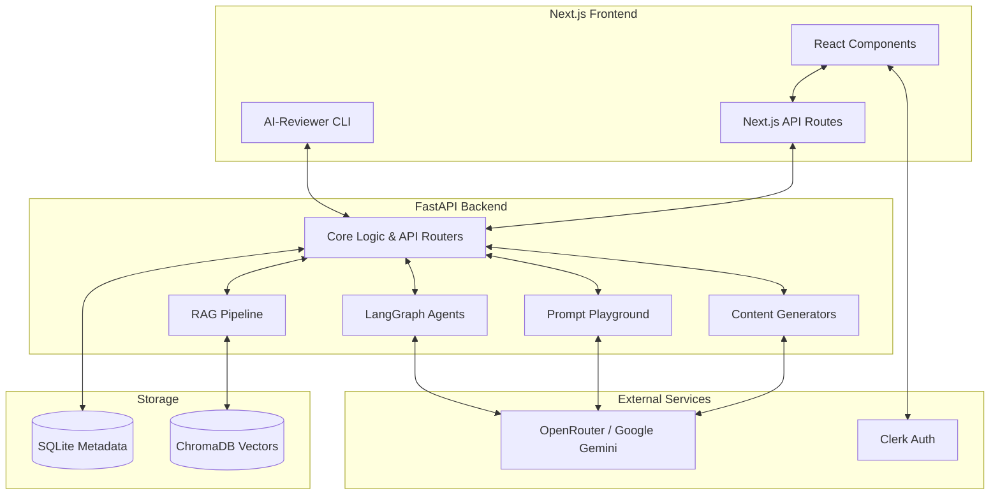

<div align="center">
  <h1>AI Productivity Suite</h1>
  <p><strong>A modern, high-performance AI productivity platform with 5 specialized AI-powered modules. Built with a stunning xAI-inspired dark interface, featuring a Next.js frontend and a Python/FastAPI backend powered by LangGraph.</strong></p>
  <p>
    <a href="#features">Features</a> • 
    <a href="#tech-stack">Tech Stack</a> • 
    <a href="#architecture">Architecture</a> • 
    <a href="#project-structure">Project Structure</a> • 
    <a href="#getting-started">Getting Started</a> • 
    <a href="#design-system">Design System</a>
  </p>
</div>

---

## Features

The AI Productivity Suite is divided into 5 core intelligent modules, designed to accelerate research, development, and workflow automation.

### 1. AI Research Assistant
RAG-powered document analysis engine. Ingest PDFs, Word documents, YouTube transcripts, and Web URLs to chat with your data. Features structured content generation including:
- Smart Summaries & Notes
- Auto-generated Flashcards & Quizzes
- Visual Mind Maps

### 2. AI Code Reviewer
Automated, multi-step code analysis powered by LangGraph.
- Deep bug detection and optimization suggestions.
- Real-time streaming of analysis steps.
- Comes with a global CLI tool (`ai-reviewer`) for terminal-based reviews.

### 3. Prompt Playground
A dedicated multi-provider prompt testing sandbox.
- Compare models across OpenRouter and Google Gemini.
- Version control your prompts.
- Analyze execution metrics and performance.

### 4. Web Research Agent
An autonomous web research assistant driven by LangGraph.
- Automatically plans research, searches the web, reads pages, and synthesizes findings.
- Streams live progress and intermediate insights to the UI.
- Generates comprehensive markdown reports with citations.

### 5. Workflow Automation
A visual, drag-and-drop workflow builder.
- Create complex pipelines using a node catalog.
- Connect AI models, logic gates, and custom scripts visually using React Flow.

---

## Tech Stack

The platform is built on a modern, decoupled architecture ensuring high performance, type safety, and scalability.

| Layer | Technologies |
|-------|--------------|
| **Frontend** | Next.js 16 (App Router), React 19, TypeScript 5.7 |
| **Styling & UI** | Tailwind CSS 4, shadcn/ui, Base UI, React Flow, Lucide Icons |
| **Backend** | Python 3, FastAPI, Uvicorn, Pydantic |
| **AI & Orchestration** | LangGraph, LangChain, Google GenAI SDK |
| **Database & Vector Store** | SQLite (Metadata & Chat History), ChromaDB (Embeddings) |
| **Authentication** | Clerk (`@clerk/nextjs`) |
| **LLM Providers** | OpenRouter (Free/Pro models), Google Gemini |

---

## Architecture



---

## Project Structure

```text
ai-productivity-suite/
├── frontend/                     ← Next.js Application
│   ├── app/                      ← App Router (pages, API routes, modules)
│   ├── components/               ← React components (ui/, shared/, workflow/)
│   ├── lib/                      ← Utilities, auth context, hooks
│   ├── bin/                      ← Global CLI tools (e.g., ai-reviewer)
│   └── public/                   ← Static assets
│
├── backend/                      ← FastAPI Application
│   ├── app/
│   │   ├── core/                 ← LLM clients, configuration, SQLite setup
│   │   ├── routers/              ← API endpoints (chat, ingest, code-review, etc.)
│   │   ├── generators/           ← Content generators (flashcards, mindmaps)
│   │   ├── rag/                  ← RAG pipeline (embedders, retrievers, chroma store)
│   │   ├── web_research_agent/   ← LangGraph Web Research Agent logic
│   │   ├── code_review_agent/    ← LangGraph Code Review Agent logic
│   │   └── prompt_playground/    ← Prompt Playground backend
│   └── data/                     ← Runtime DBs (SQLite, ChromaDB)
│
└── DESIGN.md                     ← xAI-inspired design system documentation
```

---

## Getting Started

Follow these steps to get the suite running locally.

### 1. Clone the Repository
```bash
git clone https://github.com/your-username/ai-productivity-suite.git
cd ai-productivity-suite
```

### 2. Frontend Setup
Navigate to the frontend directory, install dependencies, and configure environment variables.
```bash
cd frontend
pnpm install

# Setup environment variables
cp .env.example .env.local
# Add your Clerk API keys in .env.local

# Start the Next.js development server
pnpm dev
```
The frontend will be available at [http://localhost:3000](http://localhost:3000).

### 3. Backend Setup
Open a new terminal, navigate to the backend directory, and install Python dependencies.
```bash
cd backend

# Create a virtual environment (optional but recommended)
python -m venv venv
source venv/bin/activate  # On Windows use `venv\Scripts\activate`

# Install dependencies
pip install -r requirements.txt

# Setup environment variables
cp .env.example .env
# Add your OpenRouter or Gemini API keys in .env

# Start the FastAPI server
uvicorn app.main:app --reload --port 8000
```
The backend API docs will be available at [http://localhost:8000/docs](http://localhost:8000/docs).

### 4. Optional: CLI Installation
To use the Code Reviewer globally from your terminal:
```bash
cd frontend
npm link
ai-reviewer path/to/your/code.js
```

---

## Design System

The application utilizes a stunning **xAI-inspired design language**. 
- **Palette:** Near-black canvas (`#0a0a0a`) with striking white pill outlines and muted sunset/dusk gradient accents.
- **Typography:** Proprietary geometric sans (Universal Sans / Inter) paired with Geist Mono for technical labels and eyebrows.
- **Components:** High-contrast minimal interfaces, glassmorphic elements, and micro-animations designed to look "engineered-cosmic" and highly professional.
*For detailed design guidelines, please refer to the `DESIGN.md` file.*

---
<div align="center">
  <p>Built by AI Productivity Engineers.</p>
</div>
