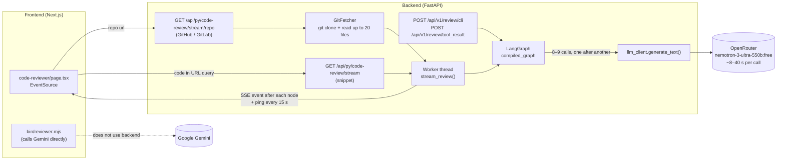
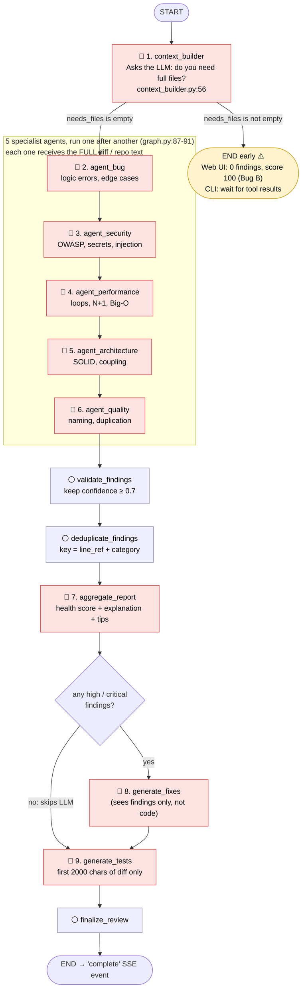
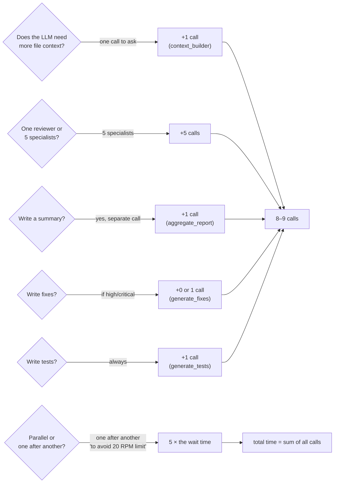
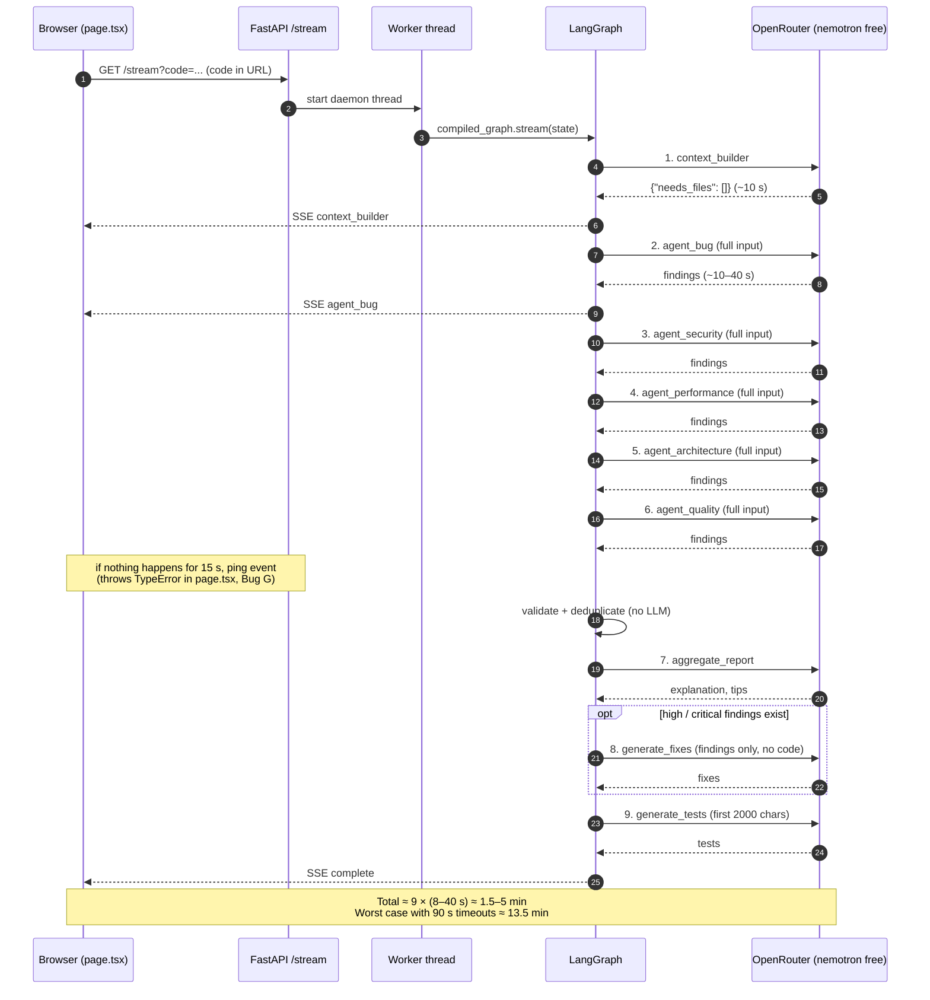
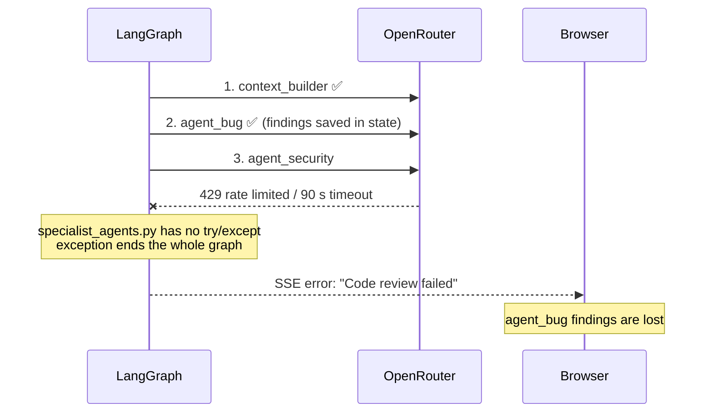
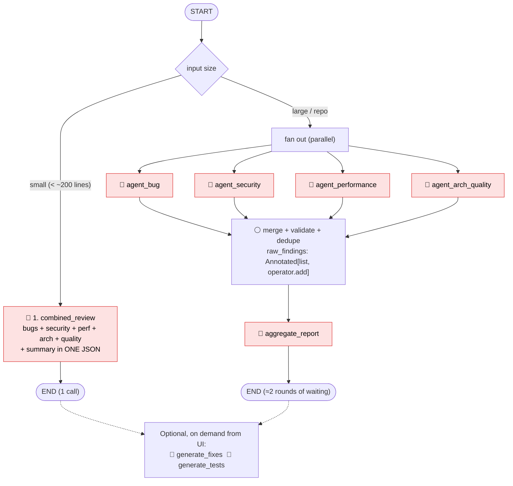

# Code Reviewer Agent — Architecture

This file shows how a review moves through the system and **where each LLM call happens**. The diagrams match the current code in `backend/app/code_review_agent/`.

---

## 1. System overview

How a review request goes from the browser to the LLM and back.

---

## 2. The LangGraph pipeline — where the 9 LLM calls happen

🔴 = makes an LLM call  ⚪ = plain Python, no LLM call

### Counting the calls

| # | Node | File | When it runs |
|---|---|---|---|
| 1 | `context_builder` | `context_builder.py:56` | Always |
| 2 | `agent_bug` | `specialist_agents.py:60` | Always |
| 3 | `agent_security` | `specialist_agents.py:85` | Always |
| 4 | `agent_performance` | `specialist_agents.py:109` | Always |
| 5 | `agent_architecture` | `specialist_agents.py:133` | Always |
| 6 | `agent_quality` | `specialist_agents.py:158` | Always |
| 7 | `aggregate_report` | `post_processor.py:70` | Always |
| 8 | `generate_fixes` | `post_processor.py:105` | Only when there are high or critical findings |
| 9 | `generate_tests` | `post_processor.py:134` | Always |

**8 calls every time, 9 when there are high or critical findings.** None of them run in parallel.

---

## 3. Why there are 9 calls: the design decisions behind each one

1. **context_builder (+1):** added so the agent could ask the CLI for full files. On the web UI nothing ever sends those files, and the agents don't use them anyway (Bug C). The call does nothing useful on the web path.
2. **5 specialists (+5):** each review area is a separate prompt carrying the **same full input**. One prompt asking for all 5 categories would give similar findings in 1 call.
3. **Run one after another:** `graph.py:87` says `# Sequential Agents to avoid 20 RPM limit`. 9 calls is well under 20 per minute, but running in order means each wait adds to the total.
4. **aggregate_report, generate_fixes, generate_tests (+2 or 3):** each is a separate call, and fixes and tests run even when the user may not need them.

---

## 4. Timeline of one review (sequence diagram)

With the current model, each call takes about 8–40 s (see `backend/hang_output.log`).

### What happens when one call fails (Bug A)

---

## 5. Suggested architecture (fewer calls)

A version with **1–2 calls for small inputs** and **3 calls for larger ones**, with the specialists running in parallel:

| Version | LLM calls | Waits (one after another) | Rough time with a fast model |
|---|---|---|---|
| Current | 8–9 | 8–9 | — (1.5–5 min on nemotron free) |
| Suggested, small input | 1 | 1 | ~5–15 s |
| Suggested, repo | 5 | 2 (parallel round + summary) | ~20–60 s |

The times for the suggested version are estimates; they haven't been measured.
