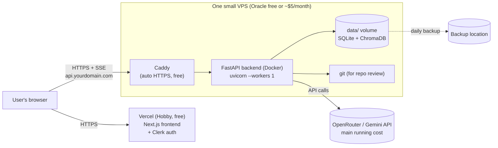

# Deployment Plan — AI Productivity Suite (Low Budget)

_Date: 2026-10-03_

**Goal:** deploy the whole project (Next.js frontend + FastAPI backend with all the agents) for **about $0–6 a month in hosting**, keeping LLM costs as low as possible.

**Short version:** Next.js on **Vercel (free)**, the FastAPI backend in **Docker on one small server** (Oracle Always Free or about $5/month), **Caddy** for free HTTPS, and a **fast, cheap LLM model**. Before going live, fix the code issues in Phase 1, especially the backend's missing authentication.

Related docs: [`analysis.md`](./analysis.md) (bugs and performance), [`architecture.md`](./architecture.md) (pipeline diagrams).

---

## 1. What the project needs to run

These come from the current code and decide which hosting will work.

| Need | Where it comes from | Effect on hosting |
|---|---|---|
| **Requests that stay open for minutes** | Code review and web research stream results over SSE for 1–5 minutes (`routers/code_review.py`, `routers/web_research.py`) | Serverless functions (Vercel, Netlify, AWS Lambda) **time out**. The backend needs a server that stays running. |
| **Files that survive restarts** | SQLite at `backend/data/chat_history.db`, ChromaDB at `backend/data/chroma_data` (`config.py:23-27`) | Free tiers that **wipe the disk** on restart or redeploy (Render free, Hugging Face Spaces free) would lose chat history and embeddings. |
| **One process** | Sessions kept in memory: `_session_store` and hardcoded `"mock-session-id"` (`code_review_agent/runner.py:17,30`) | Run **a single uvicorn worker**. Don't scale to several instances. |
| **The `git` program** | `services/git_fetcher.py` runs `git clone` | It has to be installed in the server or container. |
| **Background threads** | SSE workers use `threading.Thread(daemon=True)` | Needs a normal long-running process (a VPS or container is fine). |
| **Next.js 16 + Clerk** | `frontend/package.json` | Easy on Vercel; Clerk has a free tier. |

---

## 2. Target architecture



### Why this setup

- **Frontend on Vercel:** built for Next.js, free, with automatic deploys from GitHub.
  - ⚠️ The Hobby plan is for **non-commercial** use. If this becomes a paid product, move to Vercel Pro or self-host the frontend (Option B below).
- **Backend on a VPS:** the only cheap option that handles long SSE requests, keeps files on disk, and lets you install `git`.
- **Caddy:** gets and renews HTTPS certificates automatically, with a 3-line config.
- **Browser connects to the backend directly** (`api.yourdomain.com`) instead of going through Vercel's rewrite proxy. Long SSE streams through a proxy are more likely to be cut off.

### Option B: everything on one server

Run the frontend with `next start` on the same VPS, behind the same Caddy. One server, one domain, no CORS issues. This is a good choice if the project becomes commercial, or if you'd rather manage one machine. It needs about 1–2 GB more RAM.

---

## 3. Choosing a host

### Backend server (cheapest first)

| Option | Approx. cost | Pros | Cons |
|---|---|---|---|
| **Oracle Cloud Always Free (ARM Ampere)** | $0 | Generous resources, persistent disk | Sign-up can be difficult; free ARM capacity isn't always available |
| **Hetzner Cloud (CX/CAX small)** | ~€4–5/month | Reliable, good value, 2 vCPU / 4 GB | Small paid cost |
| **DigitalOcean / Vultr / Linode** | ~$5–6/month | Simple, good docs | Slightly more expensive for the same specs |
| ~~Render free~~ | $0 | Easy | Sleeps after inactivity (about a minute to wake up), disk not persistent → **not recommended** |
| ~~Vercel / Netlify functions~~ | $0 | — | Time out on long SSE requests → **won't work for the backend** |

> Prices are approximate and change over time; check each provider's current pricing.

**Recommended size:** 2 vCPU, **2–4 GB RAM**, 20+ GB disk. ChromaDB and the Python dependencies need more than 1 GB of RAM to run comfortably.

### Other services

| Service | Plan | Cost |
|---|---|---|
| Vercel | Hobby | $0 |
| Clerk | Free tier | $0 |
| Domain (optional) | any registrar | ~$10–12/year |
| HTTPS certificate | Caddy + Let's Encrypt | $0 |

---

## 4. LLM costs — the biggest running cost

Hosting is cheap. **LLM calls are what cost money**, and right now the code review agent makes many of them.

### Current situation

- Each code review makes **8–9 LLM calls** one after another (see `architecture.md`).
- The configured model, `nvidia/nemotron-3-ultra-550b-a55b:free`, is **slow**: 8–40 s per call (see `backend/hang_output.log`).
- **Free OpenRouter models have daily request limits.** With 8–9 calls per review, the limit gets used up after just a few reviews.
  - The limits change. Check OpenRouter's current free-tier rules. Previously, a one-time credit purchase raised the daily limit for free models a lot.

### What to do

1. **Reduce the number of calls per review first** (fixes 2 and 3 in `analysis.md`): one combined review call for small inputs, specialists in parallel for large ones. This cuts calls from **9 to 1–2**, so roughly **5× less LLM usage**.
2. **Use a fast, cheap model** instead of a slow free reasoning model:
   - Gemini Flash-class models (Google AI Studio has a free tier with rate limits), or
   - a cheap paid model on OpenRouter.
   With 1–2 calls per review, each review likely costs a fraction of a cent.
3. **Use one model setting.** Right now `config.py:33` and `llm_client.py:36` have different defaults. Set `OPENROUTER_MODEL` explicitly in the server's `.env`.
4. **Set a spending limit** in the OpenRouter or Google Cloud dashboard so a bug or abuse can't run up a large bill.

---

## 5. The plan, step by step

### Phase 1 — Code changes before deploying (required)

| # | Task | Where | Why |
|---|---|---|---|
| 1.1 | **Add authentication to backend routes.** Verify the Clerk JWT on every `/api/py/*` and `/api/v1/*` route. | `backend/app/main.py`, all routers | Right now **anyone who finds the backend URL can use up your LLM budget**. Most important item. |
| 1.2 | **Add per-user rate limits** (e.g. `slowapi`: about 10 reviews/hour per user). | `backend/app/main.py` | Protects your budget from abuse and from bugs that retry in a loop. |
| 1.3 | **Replace hardcoded `http://localhost:8000`** with `process.env.NEXT_PUBLIC_API_URL` (8 places). | `frontend/app/modules/code-reviewer/page.tsx`, `.../code-reviewer/integrations/page.tsx`, `.../research-assistant/page.tsx`, `.../web-research-agent/page.tsx`, `frontend/components/layout/sidebar.tsx` | The deployed frontend can't reach `localhost`. |
| 1.4 | **Update the EventSource URLs** that use `/api/py/...` (Next.js rewrite) to use `NEXT_PUBLIC_API_URL`. | `code-reviewer/page.tsx:134`, `integrations/page.tsx:124`, others | Avoids proxying long SSE streams through Vercel. |
| 1.5 | **Limit CORS** to your frontend domain(s). | `backend/app/main.py:63-67` (`allow_origins=["*"]` + `allow_credentials=True`) | Allowing every origin together with credentials is unsafe. |
| 1.6 | **Fix bug M1:** stop sending the GitHub token in the URL. Send it in a POST body or header. | `integrations/page.tsx:124`, `routers/code_review.py:212-219` | Otherwise tokens end up in uvicorn and proxy logs on the server. |
| 1.7 | **Fix bug M3:** only allow `https://github.com/...` and `https://gitlab.com/...` URLs, and add `timeout=` to `git clone`. | `services/git_fetcher.py` | Stops the server from fetching internal addresses, and stops clones from hanging forever. |
| 1.8 | **Reduce the code review's LLM calls** (fixes 2–4 in `analysis.md`) and switch to a faster model. | `code_review_agent/graph.py`, `specialist_agents.py`, `.env` | Faster reviews, and much lower LLM cost. |
| 1.9 | **Pin the versions in `requirements.txt`** (`pip freeze > requirements.lock` or pin by hand). Replace `duckduckgo-search` with `ddgs`. | `backend/requirements.txt` | Nothing is pinned now, so a new release of langgraph or chromadb could break a deployment. |
| 1.10 | **Use one env file.** `llm_client.py` and `gemini_client.py` load `backend/.env.local` (which doesn't exist); `config.py` loads `backend/.env`. | `backend/app/core/*.py`, `config.py` | Settings shouldn't depend on which module is imported first. |
| 1.11 | **Remove `backend/hang_output.log` from git** and add `*.log` to `.gitignore`. | repo root | It contains request logs and shouldn't be in the repo. |
| 1.12 | **Check secrets aren't in git**: `.env` and `.env.local` should only exist on the server and in Vercel's settings. | `.gitignore` | Avoid leaking API keys. |

### Phase 2 — Containerize the backend

Add these files (examples; adjust as needed):

**`backend/Dockerfile`**

```dockerfile
FROM python:3.12-slim

# git is needed for repo reviews (git_fetcher.py)
RUN apt-get update && apt-get install -y --no-install-recommends git \
    && rm -rf /var/lib/apt/lists/*

WORKDIR /app
COPY requirements.txt .
RUN pip install --no-cache-dir -r requirements.txt

COPY app ./app

# data/ (SQLite + ChromaDB) is mounted as a volume, see docker-compose.yml
ENV PYTHONUNBUFFERED=1
EXPOSE 8000

# Single worker: sessions are kept in memory (runner.py _session_store)
CMD ["uvicorn", "app.main:app", "--host", "0.0.0.0", "--port", "8000", "--workers", "1"]
```

**`docker-compose.yml`** (repo root)

```yaml
services:
  backend:
    build: ./backend
    env_file: ./backend/.env
    volumes:
      - ./backend/data:/app/data        # SQLite + ChromaDB survive restarts
    restart: unless-stopped
    expose:
      - "8000"

  caddy:
    image: caddy:2
    ports:
      - "80:80"
      - "443:443"
    volumes:
      - ./Caddyfile:/etc/caddy/Caddyfile
      - caddy_data:/data
      - caddy_config:/config
    restart: unless-stopped
    depends_on:
      - backend

volumes:
  caddy_data:
  caddy_config:
```

**`Caddyfile`** (repo root)

```
api.yourdomain.com {
    reverse_proxy backend:8000 {
        flush_interval -1    # send SSE events immediately, no buffering
    }
}
```

Test locally first: `docker compose up --build`, then open `http://localhost:8000/docs`.

### Phase 3 — Set up the server

1. Create the VPS (Ubuntu 22.04/24.04 LTS, 2 vCPU, 2–4 GB RAM).
2. Basic security:
   - log in with SSH keys only; turn off password login
   - firewall: allow only ports 22, 80 and 443 (`ufw allow OpenSSH && ufw allow 80 && ufw allow 443 && ufw enable`)
   - turn on automatic security updates (`unattended-upgrades`)
3. Install Docker and the Docker Compose plugin.
4. Point DNS: add an `A` record `api.yourdomain.com` → the server's IP address.
5. Clone the repo onto the server and create `backend/.env` with the production values (see Section 6).
6. `docker compose up -d --build`
7. Check: `https://api.yourdomain.com/docs` loads with a valid HTTPS certificate.

### Phase 4 — Deploy the frontend to Vercel

1. Import the GitHub repo into Vercel and set **Root Directory = `frontend`**.
2. Add the environment variables (Section 6).
3. Deploy, then add your custom domain (optional).
4. In the Clerk dashboard, add the production domain to the allowed origins and redirect URLs.
5. Update the backend's CORS `allow_origins` (task 1.5) to the Vercel/production domain, then restart the backend.

### Phase 5 — Backups and monitoring

| Task | How | Cost |
|---|---|---|
| **Daily backup of `backend/data/`** | A cron job that runs `tar` on the folder and uploads it (e.g. with `rclone` to free object storage or Google Drive) | $0 |
| **Uptime check** | A free uptime monitor pinging `https://api.yourdomain.com/docs` | $0 |
| **Logs** | `docker compose logs -f backend`; set Docker's log rotation (`max-size: 10m`) so logs don't fill the disk | $0 |
| **LLM spending alerts** | Set a budget limit and alerts in the OpenRouter / Google dashboards | $0 |

Example cron job (runs at 3:00 every day):

```
0 3 * * * tar czf /root/backups/data-$(date +\%F).tgz -C /path/to/repo/backend data && find /root/backups -mtime +14 -delete
```

### Phase 6 — Updating the app later

- **Frontend:** push to GitHub; Vercel deploys automatically.
- **Backend:** on the server, run `git pull && docker compose up -d --build`.
  - Running reviews and in-memory CLI sessions are lost on restart. Deploy when nobody is using the app.
- **Optional later:** a GitHub Actions workflow that SSHes into the server and runs the commands above.

---

## 6. Environment variables

### Backend — `backend/.env` (on the server only, never committed)

```
OPENROUTER_API_KEY=...
OPENROUTER_MODEL=<a fast model of your choice>
GEMINI_API_KEY=...                 # if you use Gemini directly / for embeddings
SITE_URL=https://yourdomain.com
SITE_NAME=AI Productivity Suite
DATABASE_PATH=/app/data/chat_history.db
CLERK_JWKS_URL=...                 # for verifying Clerk tokens (task 1.1)
ALLOWED_ORIGINS=https://yourdomain.com,https://your-app.vercel.app
```

### Frontend — set in Vercel's Project Settings → Environment Variables

```
NEXT_PUBLIC_API_URL=https://api.yourdomain.com
NEXT_PUBLIC_CLERK_PUBLISHABLE_KEY=...
CLERK_SECRET_KEY=...
```

---

## 7. Estimated monthly cost

| Item | Cost |
|---|---|
| Vercel Hobby | $0 |
| Clerk (free tier) | $0 |
| VPS | $0 (Oracle Always Free) or about $5 (Hetzner / DO) |
| HTTPS (Caddy + Let's Encrypt) | $0 |
| Backups + uptime monitoring | $0 |
| Domain (optional) | about $1/month (~$10–12/year) |
| **LLM API** | **Depends on use.** For personal or light use, a few dollars a month once reviews make 1–2 calls instead of 9. |
| **Total** | **About $0–7/month + LLM usage** |

---

## 8. Checklist before going live

- [ ] Backend routes require a valid Clerk token (1.1)
- [ ] Per-user rate limits are on (1.2)
- [ ] No `localhost:8000` left in the frontend (1.3, 1.4)
- [ ] CORS only allows the production domain(s) (1.5)
- [ ] GitHub token is no longer sent in the URL (1.6)
- [ ] Repo URLs are limited to GitHub/GitLab and `git clone` has a timeout (1.7)
- [ ] Code review makes 1–2 LLM calls for small inputs, with a fast model (1.8)
- [ ] `requirements.txt` versions are pinned (1.9)
- [ ] One `.env` file is used everywhere (1.10)
- [ ] Logs and secrets are not committed (1.11, 1.12)
- [ ] `docker compose up` works locally
- [ ] HTTPS works on `api.yourdomain.com`
- [ ] SSE streams aren't cut off during a long (2–5 min) review
- [ ] Daily backup of `backend/data/` runs, and a restore has been tested once
- [ ] LLM spending limit is set in the provider dashboard
- [ ] Clerk production domain and redirect URLs are configured

---

## 9. Later, if usage grows

- **More than one backend instance:** first replace the in-memory `_session_store` with a LangGraph checkpointer (SQLite or Postgres), and give each session a real UUID (bug D in `analysis.md`).
- **Move the database off the server's disk:** a managed Postgres free tier (e.g. Neon or Supabase) for chat history, and a hosted vector database if ChromaDB gets large.
- **Run reviews in a job queue** (e.g. a Redis queue with a worker process) so a backend restart doesn't kill running reviews.
- **Commercial use:** move off Vercel Hobby (to Vercel Pro, or self-host the frontend as in Option B).
