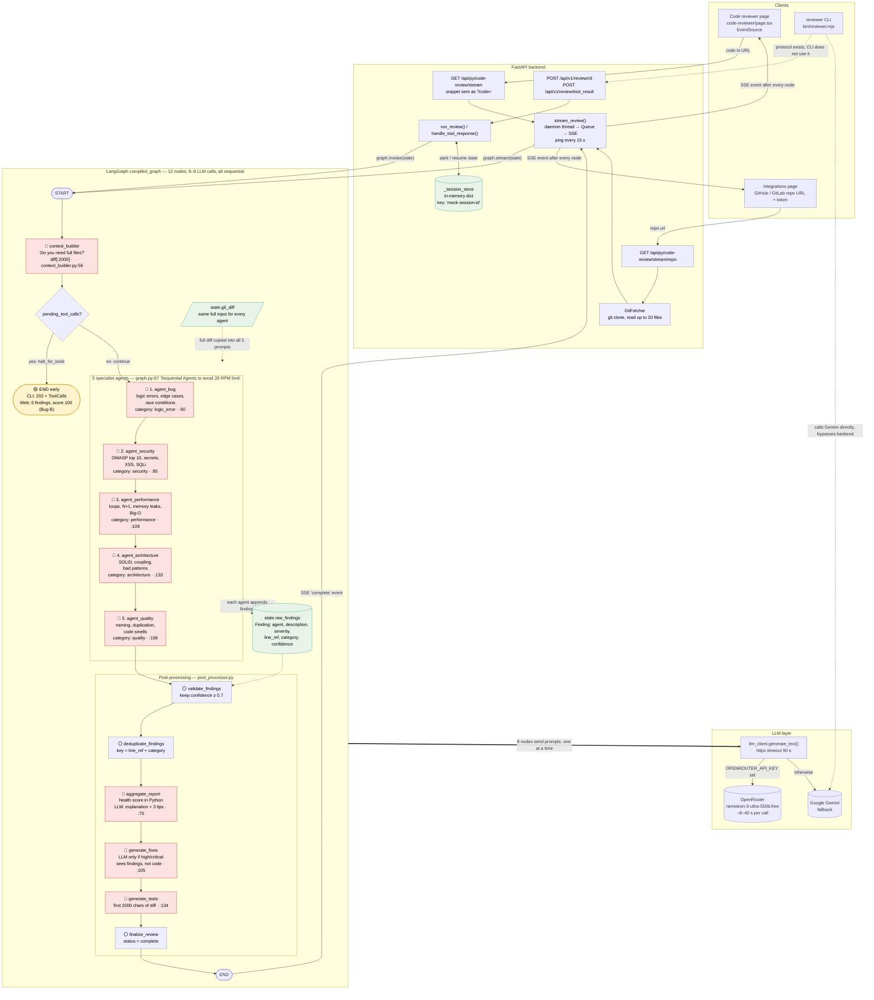
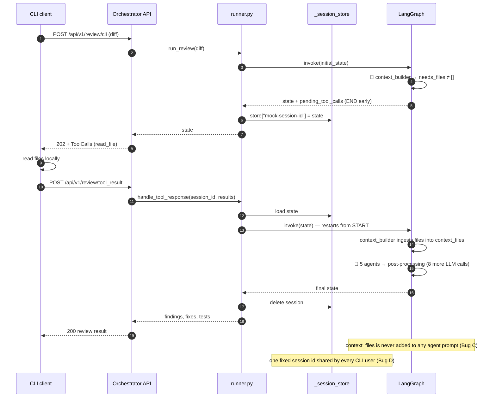
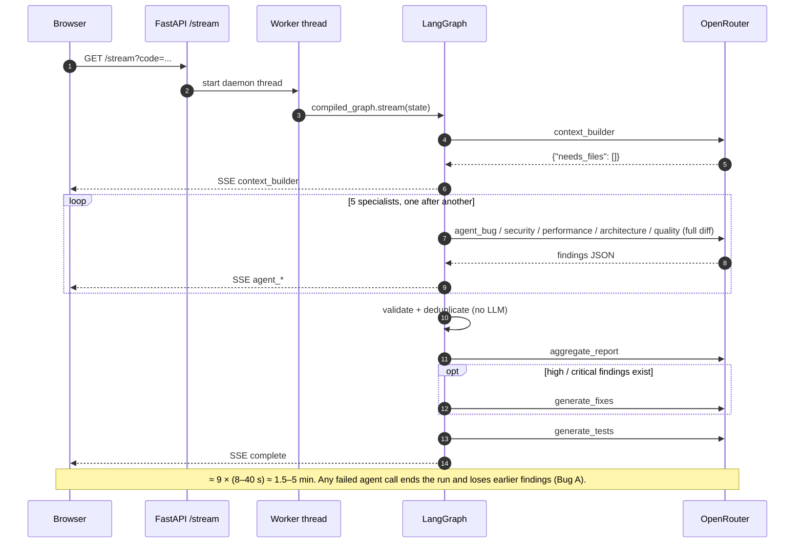
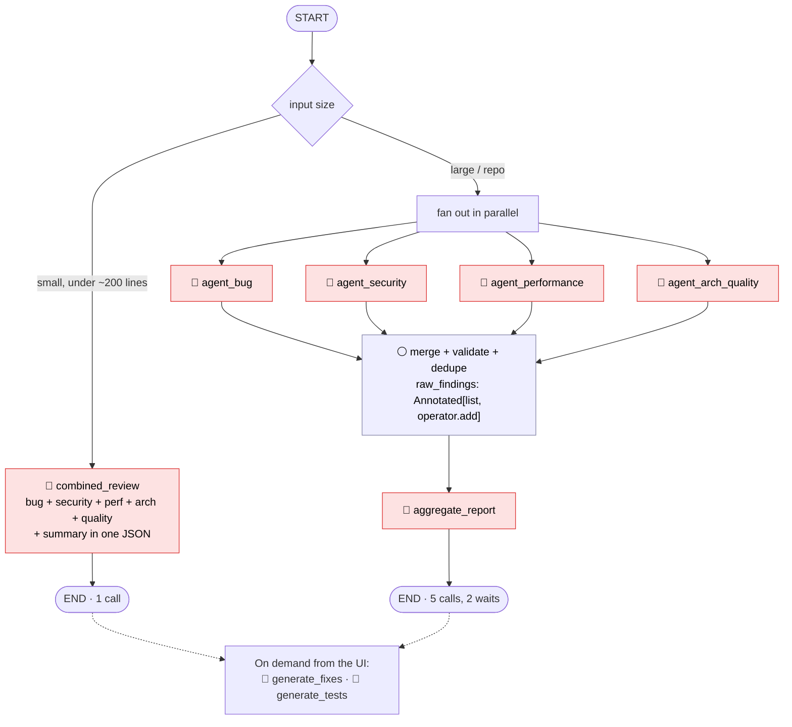

# Code Review Agent — Complete Multi-Agent Architecture

Mermaid diagrams of the whole system around the 5 specialist agents. They match the current code in `backend/app/code_review_agent/`.

🔴 = LLM call  ⚪ = plain Python  🟡 = early exit / known bug

---

## 1. Complete architecture (clients → backend → 5-agent LangGraph → LLM)

---

## 2. CLI tool-call loop (pause and resume)

---

## 3. Web review timeline (one LLM call at a time)

---

## 4. Suggested architecture (parallel fan-out, fewer calls)

